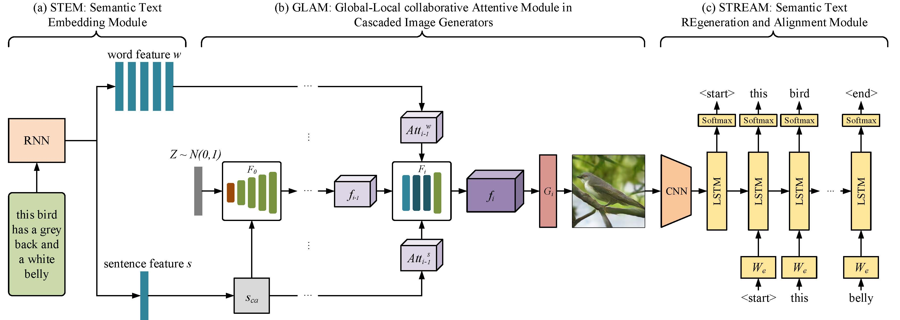

**This repo is under construction**

<hr>


*This repo is unofficial reproduction of paper [MirrorGAN: Learning Text-to-image Generation by Redescription](https://arxiv.org/abs/1903.05854)*




## Getting Started

#### Dependencies

- Python == 2.7.12
- torch == 0.4.1
- torchvision == 0.2.0

#### Dataset

Official Dataset

- [birds](https://drive.google.com/file/d/1CuW5ognTSkNbyx9TWoUFrgwqxZNk1cl0/view?usp=sharing)

Your Own Dataset

- Dataset Directory

  ```
  |- dataset
  |   |---Your Dataset Name
  |   |   |---images
  |   |   |   |---category1
  |   |   |   |   |---aaa.jpg
  |   |   |   |   |---bbb.jpg
  |   |   |   |   |---...
  |   |   |   |---category2
  |   |   |   |   |---aaa.jpg
  |   |   |   |   |---bbb.jpg
  |   |   |   |   |---...
  |   |   |   |---...
  |   |   |---resized
  |   |   |   |---category1
  |   |   |   |   |---aaa.jpg
  |   |   |   |   |---bbb.jpg
  |   |   |   |   |---...
  |   |   |   |---category2
  |   |   |   |   |---aaa.jpg
  |   |   |   |   |---bbb.jpg
  |   |   |   |   |---...
  |   |   |   |---...
  |   |---text
  |   |   |---category1
  |   |   |   |---aaa.text
  |   |   |   |---bbb.text
  |   |   |   |---...
  |   |   |---category2
  |   |   |   |---aaa.text
  |   |   |   |---bbb.text
  |   |   |   |---...
  |   |   |---...
  |   |---train
  |   |   |---filenames.pickle
  |   |---test
  |   |   |---filenames.pickle
  |   |---captions.json
  ```

- Preprocess Dataset

  Generate resized/, text/, train/, test/, captions.json

  ```bash
  python2 preprocess.py
  ```

## Train/Test

#### Pretrain

```bash
# STEM
cd GLAM
python2 pretrain_DAMSM.py

# STREAM
cd STREAM
python2 train.py
```

#### Train

```bash
cd GLAM
python2 mian.py
```

#### Test

```bash
cd GLAM
python2 mian.py --cfg cfg/eval_bird.yml
```

## Contact

If you have any questions, please feel free to contact [ZHAO WANG](mailto:kyfafyd@zju.edu.cn)

## Reference

[MirrorGAN: Learning Text-to-image Generation by Redescription](https://arxiv.org/abs/1903.05854)

[AttnGAN: Fine-Grained Text to Image Generation with Attentional Generative Adversarial Networks](http://openaccess.thecvf.com/content_cvpr_2018/papers/Xu_AttnGAN_Fine-Grained_Text_CVPR_2018_paper.pdf) 

[Image Captioning](https://github.com/yunjey/pytorch-tutorial/tree/master/tutorials/03-advanced/image_captioning)


